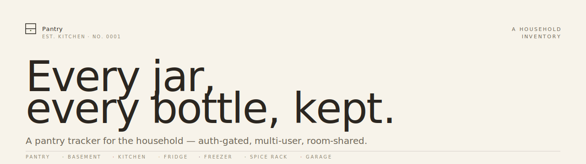
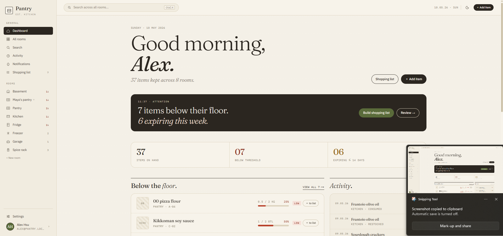
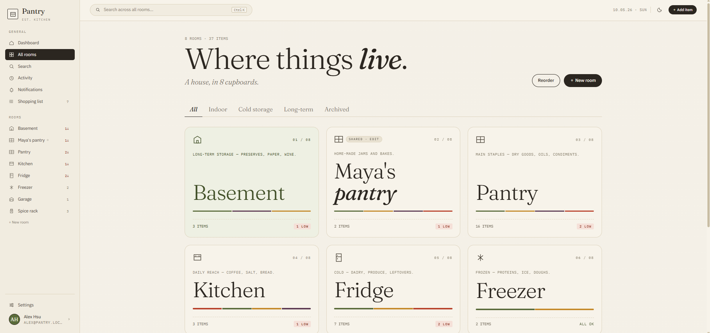
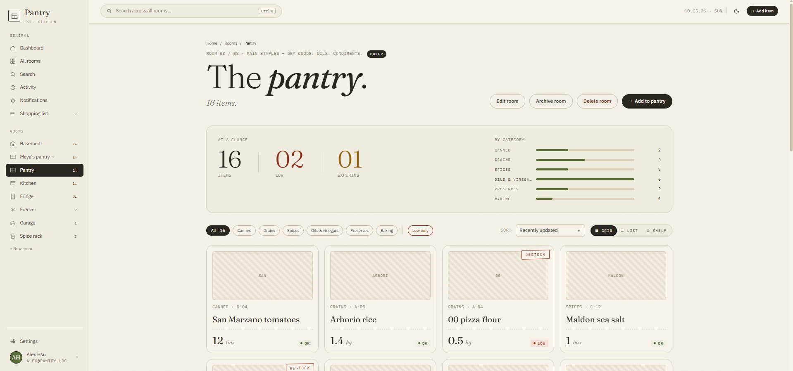
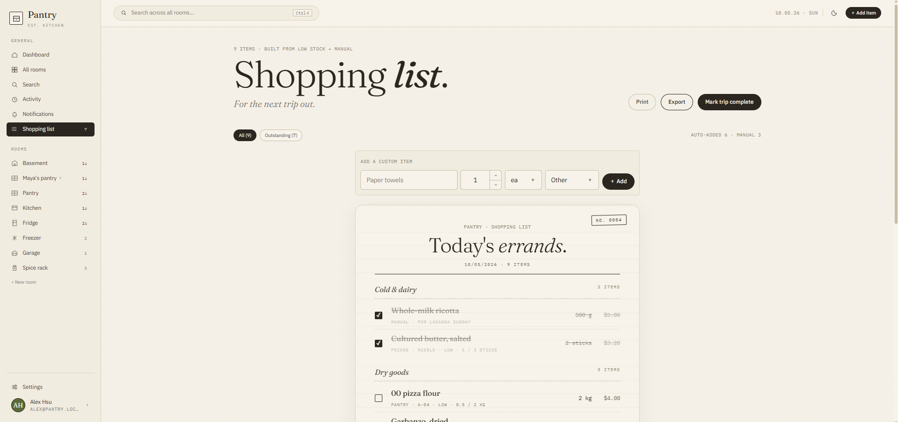
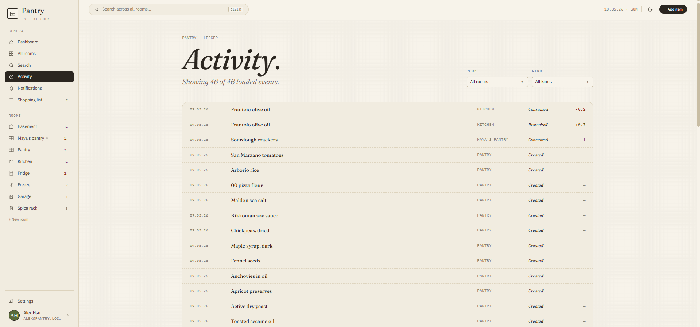
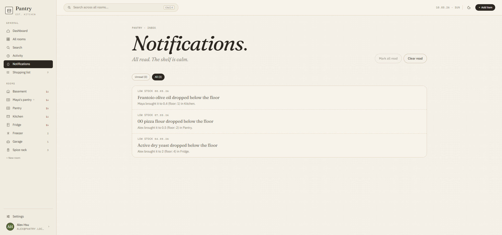

<p align="center">
  
</p>

# Pantry

A pantry tracker for the household — every jar, every bottle, every bag, kept in its room. Auth-gated, multi-user, with room-level sharing.

## Features

### Inventory
- **Rooms** — organize items by room (pantry, fridge, freezer, etc.). Drag-and-drop reorder, custom glyphs, grid / list / shelf view per room. Shelf view groups by shelf label.
- **Items** — count, unit, expiry date, tags, photo, status (in-stock / low / out / expiring / expired). Mark-opened, debounced quantity stepper, edit / move / delete.
- **Add-item form** with live preview, photo upload, tag input.
- **Sort** items per room by recently updated, name, count, or expiry.
- **Dashboard** — morning glance with low-stock list, expiring strip, recent activity, room glance, and an attention banner.

### Barcode scanning
- **Scan page** (`/scan`) — point the device camera at any EAN-8, EAN-13, or UPC-A barcode.
- If the code matches an existing item in your pantry, you can open it, bump the count by one, or mark it opened — all without leaving the scan flow.
- Unknown barcodes are looked up on **Open Food Facts**. Found products can pre-fill the add-item form (name, brand, image, quantity); unrecognised codes drop you into a manual add form with the barcode pre-set.
- Barcode scanning is also accessible inline from the **add-item form** via a modal scanner button.

### Search & shopping
- **Full-text search** across all items with multi-room, category, and status facets.
- **Shopping list** in receipt style, grouped by aisle. Add items from any item's stepper or as free-form manual entries, mark trip complete, export as text, browser print.

### Sharing (multi-user)
- Rooms are owned by a user. Owners invite collaborators by email at **viewer** or **editor** role.
- If the invitee already has an account they're added immediately. Otherwise they receive an email with a tokenized accept link (`/invite/<token>`) that walks them through sign-up and joins them on accept.
- Each room has a **QR code** button that generates a styled QR pointing at the invite link — downloadable as PNG or copy-to-clipboard, useful for printing shelf labels.
- Shared rooms appear in the invitee's sidebar with a `◇` glyph.
- Editors can mutate items; viewers are read-only. Manage from the per-room Members panel or `/settings → Sharing`.

### Notifications
- **In-app inbox** at `/notifications` with an unread-count badge in the sidebar.
- **Threshold-cross alerts** — when an item drops below its floor, every room member except the actor gets a notification.
- **Email digest** of low-stock items, opt-in per user (off / daily / weekly) from `/settings`. Sent by the `/api/cron/digest` endpoint, intended to be hit by Vercel Cron.

### Activity log
- Every count change, restock, open, etc. is recorded as an event with the actor's user id.
- Dedicated `/activity` page with paginated feed, filterable by room and event kind.

### Auth & accounts
- Email + password sign-in (NextAuth, scrypt hashing, JWT sessions).
- Sign-up flow with **email verification** — a one-time token is emailed on registration; `/verify-email` confirms it before the account is fully active.
- Profile + email + password change in `/settings`. Email or password change requires the current password; password rotation invalidates all other sessions via a per-user password version.
- Forgot-password / reset-password flow via one-time email tokens.
- Rate limiting on signin, signup, invite, and password-reset endpoints.
- Session middleware gates every page; safe-redirect helper guards the `?next=` parameter.

### UX polish
- Command palette (⌘K / Ctrl+K) with platform-aware key hints.
- Toast notifications, confirm dialogs for destructive actions.
- Mobile drawer sidebar; chip-style filter on narrow screens, tablist on desktop.
- Custom 404.

## Stack

- **Next.js 15** (App Router, Turbopack dev) + **React 19** + **TypeScript**
- **Tailwind CSS v4** with theme tokens via `@theme`
- **NextAuth v5** — Credentials provider, JWT sessions, scrypt password hashing
- **Drizzle ORM** + **libSQL/Turso** (also runs on local SQLite)
- **SWR** for client data fetching, **Zod** for validation, **react-hook-form** for forms
- **Vercel Blob** for item photo uploads
- **nodemailer** (SMTP) for transactional email — password resets, room invites, digests
- **@dnd-kit** for drag-and-drop reorder
- **OpenAPI** schema generated from Zod, typed client via `openapi-fetch` + `swr-openapi`
- **Vitest** integration tests (real SQLite, no mocks except `auth()`)
- **Playwright** end-to-end tests against a dedicated test database

## Getting started

You'll need Node.js 20+ and npm.

```bash
git clone <this-repo>
cd pantry
npm install
cp .env.example .env       # set AUTH_SECRET to any 32+ char string
npm run db:push            # creates local.db with the schema
npm run db:seed            # 9 rooms (1 archived, 1 shared in), ~46 items, 3 demo users, pending invite
npm run dev
```

Open [http://localhost:3000](http://localhost:3000) and sign in with **alex@pantry.local / password123**, or create your own account at `/welcome`.

### Environment variables

| Variable | Required | Notes |
|---|---|---|
| `AUTH_SECRET` | yes | Any 32+ character string. Generate with `openssl rand -hex 32`. |
| `DATABASE_URL` | no | Defaults to `file:local.db`. Set to a `libsql://...` URL for Turso. |
| `DATABASE_AUTH_TOKEN` | no | Required when `DATABASE_URL` points to Turso. |
| `BLOB_READ_WRITE_TOKEN` | no | Only needed if you use the photo upload feature in production. |
| `SMTP_HOST` / `SMTP_PORT` | no | SMTP server for outbound mail. Defaults to Gmail (`smtp.gmail.com:587`). |
| `SMTP_USER` / `SMTP_PASS` | no | SMTP credentials. For Gmail, use an App Password. Without these, password-reset and pending-invite emails are disabled (the API returns a clear 503). |
| `EMAIL_FROM` | no | Sender address shown in outbound mail. Required alongside `SMTP_USER`/`SMTP_PASS`. |
| `APP_URL` | no | Public URL of the app — used to build links in emails. Defaults to `http://localhost:3000` in dev; required in production. |
| `CRON_SECRET` | no | Shared secret for `/api/cron/digest`. Sent as `Authorization: Bearer <CRON_SECRET>`; Vercel Cron does this automatically. |

## Scripts

| | |
|---|---|
| `dev` | Start dev server (Turbopack) |
| `build` / `start` | Production build / serve |
| `test` / `test:watch` | Vitest integration suite |
| `e2e` / `e2e:ui` | Playwright end-to-end suite (seeds a dedicated test DB first) |
| `lint` / `lint:fix` | ESLint |
| `format` / `format:check` | Prettier (sorts Tailwind classes) |
| `db:push` | Push Drizzle schema to the local DB |
| `db:push:prod` | Push Drizzle schema to the production DB. Reads `.env.production`. |
| `db:seed` | Seed demo users, rooms, items, a pending invite, and sample notifications |
| `db:seed:prod` | Same demo data, scoped to the three `*@pantry.local` accounts only — leaves real users untouched. Reads `.env.production` (pull with `npx vercel env pull .env.production --environment=production`). |
| `db:reset` | Wipe local SQLite, push schema, re-seed |
| `db:studio` | Open Drizzle Studio |
| `openapi:generate` | Re-generate `lib/api/openapi.{json,d.ts}` from the Zod registry |

## Project structure

```
app/                            routes (App Router) + api/
  layout.tsx                    fonts + SessionProvider + ToastProvider
  page.tsx                      redirect → /dashboard or /welcome
  globals.css                   @theme tokens + base resets
  welcome/  sign-in/  sign-up/  auth pages
  forgot-password/              request a reset link
  reset-password/               set a new password from a token
  invite/[token]/               accept-invite landing page
  dashboard/                    morning glance
  rooms/                        grid + per-room detail + members panel
  items/                        detail + new-item form
  search/  shopping/  activity/ feature pages
  scan/                         barcode scanner + Open Food Facts lookup
  notifications/                in-app notifications inbox
  settings/                     profile + password + sharing + digest
  verify-email/                 email verification landing page
  api/                          REST handlers
    notifications/              list, mark-read, unread count
    cron/digest/                low-stock email digest endpoint
    invites/[token]/            preview + accept pending invites
    password-reset/             request + confirm reset
    barcode/[code]/             pantry match + Open Food Facts lookup
    verify-email/               confirm email-verification token

components/                     app shell, sidebar, topbar, command palette,
                                modals, toasts, forms, photo upload, stepper

icons/                          one per file, named XxxIcon

lib/                            cn, cva variants, access checks, format,
                                password (scrypt), drizzle queries,
                                email (nodemailer), rate limit, safe redirect,
                                hashed tokens, OpenAPI registry + typed client

db/
  schema.ts                     users, rooms, room_members, room_positions,
                                items, shopping_items, shopping_trips,
                                item_events, notifications, password_resets,
                                pending_invites
  index.ts                      drizzle client

scripts/                        seed, reset-db, check-db, generate-openapi,
                                seed-prod, seed-shared
tests/                          vitest integration tests
e2e/                            playwright specs + test-db setup
auth.ts / auth.config.ts        NextAuth setup
middleware.ts                   gates every page
```

## Testing

```bash
npm test              # vitest integration suite (real SQLite)
npm run test:watch    # watch mode
npm run e2e           # playwright e2e against a fresh test DB
npm run e2e:ui        # same, in Playwright's UI runner
```

Vitest tests use a real SQLite database (no mocks except `auth()`). Playwright spins up a dedicated dev server against a temp SQLite file under `e2e/.test-db-path`, with rate limiting bypassed via `E2E_BYPASS_RATE_LIMIT=1`.

GitHub Actions runs three workflows on every push to `main`, every pull request, and on demand from the Actions tab: `test.yml` (lint + `next build`), `api-tests.yml` (Vitest), and `e2e-tests.yml` (Playwright). Prettier formatting is enforced via `eslint-plugin-prettier`, so the lint job covers it. See `.github/workflows/`.

## Screenshots

| | |
|:---:|:---:|
|  |  |
| **Dashboard** — morning glance with low-stock, expiring strip, attention banner | **Rooms** — owned and shared rooms, drag-reorderable, filterable |
|  |  |
| **A room** — items grouped by shelf, status chips, quantity stepper | **Shopping** — receipt-style, grouped by aisle, mark trip complete |
|  |  |
| **Activity** — paginated feed, filterable by room and event kind | **Notifications** — in-app inbox with unread badge in the sidebar |

## License

[MIT](LICENSE)
